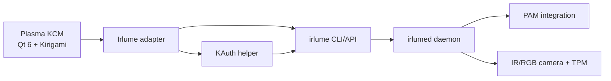

# plasma-irlume — Fedora 44 KDE Face Login Project Plan

## Outcome

Build a native KDE Plasma System Settings module that makes secure face login understandable, testable, reversible, and maintainable on Fedora 44 KDE.

The project will not implement another facial-recognition engine. It will integrate with `irlume`, which already provides the PAM module, local inference, IR anti-spoofing, TPM-sealed templates, Fedora packaging, and tested Plasma Login Manager support.

For the user, version 1.0 should provide:

- a clear hardware and security readiness check;
- guided face enrollment and recognition testing;
- separate, explicit controls for lock-screen and login-screen authentication;
- password fallback at all times;
- safe enable, disable, rollback, and TTY recovery;
- useful diagnostics without exporting images or biometric templates;
- a native Plasma 6 / Kirigami interface.

Recommended repository name: `plasma-irlume`

Recommended application identity: `io.github.loofiboss_bit.plasma_irlume`

## Current State

### Fedora 44 and KDE

- Fedora 44 KDE fresh installations use Plasma Login Manager (`plasmalogin`) instead of SDDM.
- Systems upgraded from an older Fedora release may retain SDDM.
- The project must detect the active display manager; it must not assume one PAM service name.
- Fedora 44 provides distribution PAM defaults under `/usr/lib/pam.d`, while local overrides may exist under `/etc/pam.d`.
- Directly editing the global `system-auth` stack is unnecessarily broad for the first release and creates a larger lockout risk.

### Existing face-authentication projects

| Project | Useful strengths | Reason not to use as the project base |
| --- | --- | --- |
| Howdy | Mature awareness, PAM integration, Fedora COPR | Upstream explicitly warns that photos may bypass it; Fedora/Python compatibility has been fragile |
| Facelock | Modern Rust design, liveness, encryption, RPM work | Small project and its documented model weights have non-commercial licensing constraints |
| Visage | Rust daemon, PAM, ONNX and IR support | Ubuntu-focused and explicitly not production-ready |
| Gaze | GUI, PAM, Fedora and KDE support | Broad cross-desktop product; does not fill the specific Plasma System Settings integration niche |
| irlume | Fedora COPR, Plasma Login Manager support, IR security tier, TPM sealing, password fallback, recovery tooling | Has a TUI and CLI, but no native KDE KCM/GUI |

### Selected dependency

Use `irlume >= 0.6` as the authentication engine, but treat its pre-1.0 interfaces as unstable.

The KDE project owns only:

- presentation and workflow;
- capability detection;
- a narrow privileged action bridge;
- version compatibility checks;
- redacted diagnostics;
- Fedora/KDE-specific packaging and tests.

The engine continues to own:

- camera and IR-emitter access;
- face detection and recognition;
- liveness decisions;
- embeddings and template encryption;
- TPM access;
- PAM module behavior;
- PAM wiring plans and rollback.

## Top Priority

Make authentication changes transactional and recoverable before building enrollment polish.

A beautiful enrollment UI is not useful if a PAM mistake can prevent login or screen unlock. The first production-critical behavior is:

1. inspect the exact active login manager and PAM state;
2. preview the engine-generated change;
3. confirm password fallback is preserved;
4. apply through one narrow privileged helper;
5. verify the resulting state;
6. automatically roll back if verification fails;
7. keep a documented TTY recovery command available.

## Product Direction

### Working name

`plasma-irlume`

### User experience

Add a **Face Login** page to KDE System Settings with five sections:

1. **Overview**
   - Secure, Convenience, or Unsupported tier
   - active display manager
   - enrolled profile status
   - login and lock-screen status

2. **Face profile**
   - enroll;
   - test;
   - add another appearance scan;
   - remove the profile;
   - explain glasses, beard, lighting, and camera placement.

3. **Authentication**
   - enable lock-screen face unlock;
   - enable login-screen face unlock only for the IR Secure tier;
   - show password fallback as permanently enabled;
   - keep face authentication for `sudo` and Polkit outside version 1.0.

4. **Security**
   - IR/RGB capability;
   - TPM protection state;
   - Secure Boot state;
   - liveness mode;
   - plain-language limitations.

5. **Diagnostics**
   - daemon and PAM state;
   - last redacted failure reason;
   - run test;
   - export a redacted support report;
   - disable integration.

## Architecture



### Components

| Component | Responsibility | Privilege |
| --- | --- | --- |
| QML/Kirigami KCM | UI, workflow, confirmations and error presentation | User |
| C++/Qt backend | Capability model, process control, typed results and redaction | User |
| Irlume adapter | Version-gated interface to supported irlume commands | User |
| KAuth helper | Only approved enable/disable/apply operations | Root through Polkit |
| Test adapter | Deterministic fake hardware and engine states | None |

### Recommended stack

- C++20
- Qt 6
- KDE Frameworks 6
- Kirigami
- KCMUtils
- KAuth and Polkit
- CMake with Extra CMake Modules
- Qt Test
- QML linting
- Fedora RPM/COPR packaging

Do not run the whole GUI as root. Do not accept arbitrary command strings in the privileged helper.

### Suggested repository layout

```text
plasma-irlume/
├── CMakeLists.txt
├── README.md
├── LICENSE
├── src/
│   ├── kcm/
│   ├── backend/
│   ├── adapter/
│   └── helper/
├── qml/
│   ├── Main.qml
│   ├── OverviewPage.qml
│   ├── EnrollmentPage.qml
│   ├── SecurityPage.qml
│   └── DiagnosticsPage.qml
├── data/
│   ├── kcm_irlume.json
│   ├── io.github.loofiboss_bit.plasma_irlume.actions
│   └── io.github.loofiboss_bit.plasma_irlume.helper
├── tests/
│   ├── unit/
│   ├── integration/
│   └── fixtures/
├── packaging/
│   └── fedora/
└── docs/
    ├── ARCHITECTURE.md
    ├── SECURITY.md
    ├── RECOVERY.md
    └── TEST-MATRIX.md
```

## Scope

### Included in version 1.0

- Fedora 44 KDE Plasma Desktop on mutable/DNF-based installations;
- Plasma 6.6 and Wayland;
- automatic detection of Plasma Login Manager or SDDM;
- IR Secure tier and RGB Convenience tier;
- single local desktop user profile;
- enrollment, test, add scan, and delete profile;
- login and lock-screen controls;
- TPM and security status;
- KWallet guidance;
- password fallback;
- transactional enable/disable and rollback;
- redacted diagnostics;
- RPM and COPR release.

### Explicitly excluded from version 1.0

- a new recognition model or PAM module;
- Fedora Kinoite/rpm-ostree support;
- GNOME/GDM integration;
- multi-user administration;
- remote enrollment;
- cloud sync or telemetry;
- automatic unlock merely by walking up to the computer;
- face authentication for `sudo`, `su`, SSH, Polkit, Bitwarden, or package installation;
- direct modification of global `system-auth`;
- claiming Windows Hello certification or equivalent hardware security;
- storing face images.

## Phase 0 — Confirm the Engine Contract

### Objective and user value

Prevent the GUI from depending on human-readable CLI output or unstable internal socket formats.

### Likely affected paths

- `docs/ARCHITECTURE.md`
- `docs/ENGINE-CONTRACT.md`
- `src/adapter/`
- `tests/fixtures/irlume/`

### Tasks

1. Inspect the current `irlume` command surface, protocol, exit codes, and version output.
2. Determine whether supported structured output already exists for:
   - version;
   - doctor/capability report;
   - profile list;
   - enrollment progress;
   - recognition test;
   - PAM dry-run plan;
   - enable, disable, and post-apply verification.
3. If structured output is missing, define the smallest upstream request:
   - `irlume status --json`;
   - `irlume doctor --json`;
   - `irlume profiles list --json`;
   - newline-delimited JSON events for enrollment and test;
   - typed dry-run/apply result objects.
4. Pin a supported API/CLI compatibility range.
5. Record sanitized real outputs as fixtures.
6. Permit a narrow, version-gated parser for documented read-only commands;
   keep structured output as the required target for streaming and mutations.

### Acceptance criteria

- Every required read operation maps to a typed fixture.
- Every write operation has a documented dry-run and result contract.
- Unsupported `irlume` versions produce a clear, non-destructive message.
- No GUI code reads templates, images, TPM secrets, or private daemon state.

### Verification

```bash
irlume --version
irlume doctor
irlume profiles list
sudo irlume login enable
sudo irlume login disable
```

Run the commands only for inspection in Phase 0; omit `--apply`.

### Checkpoint

Commit only after the engine contract and fixtures are reviewed:

```text
docs: define supported irlume integration contract
```

## Phase 1 — Scaffold the Read-Only KCM

### Objective and user value

Make the module discoverable in System Settings and prove the architecture without changing authentication.

### Likely affected paths

- `CMakeLists.txt`
- `src/kcm/`
- `src/backend/`
- `qml/`
- `data/kcm_irlume.json`
- `tests/unit/`

### Tasks

1. Create the CMake/KF6 project.
2. Register a **Face Login** KCM.
3. Build a typed `SystemState` model.
4. Implement a fake adapter with states for:
   - secure IR hardware;
   - RGB-only hardware;
   - no camera;
   - missing irlume;
   - unsupported irlume version;
   - broken daemon;
   - existing PAM drift.
5. Build Overview and Diagnostics read-only pages.
6. Add accessible names, keyboard navigation, scalable layouts, and clear status colors with text labels.

### Acceptance criteria

- The module opens from KDE System Settings.
- All fixture states render without crashes or clipped controls.
- No button can invoke a privileged action.
- Status is never communicated by color alone.

### Verification

```bash
cmake -S . -B build -DCMAKE_BUILD_TYPE=Debug
cmake --build build
ctest --test-dir build --output-on-failure
qmllint qml/*.qml
```

Manual checks:

- 100%, 125%, 150%, and 200% display scaling;
- light and dark Plasma color schemes;
- keyboard-only navigation;
- narrow laptop window size.

### Checkpoint

```text
feat: scaffold read-only Plasma face login KCM
```

## Phase 2 — Live Fedora and Hardware Diagnostics

### Objective and user value

Tell the user whether the machine can safely provide secure login before enrollment begins.

### Likely affected paths

- `src/adapter/`
- `src/backend/SystemProbe.*`
- `qml/OverviewPage.qml`
- `qml/SecurityPage.qml`
- `tests/integration/`

### Tasks

1. Read Fedora and Plasma versions.
2. Detect the active display manager via the `display-manager.service` target.
3. Distinguish Plasma Login Manager from SDDM.
4. Consume the supported irlume capability surface through the reviewed
   adapter (structured output when available, otherwise the narrow 0.6.x
   read-only parser).
5. Present one of three tiers:
   - **Secure**: IR camera and required liveness checks available;
   - **Convenience**: RGB camera, lock-screen only;
   - **Unsupported**: no valid camera or engine failure.
6. Show TPM, Secure Boot, daemon, camera, emitter, enrollment, and PAM status.
7. Add a redacted support-report preview.

### Acceptance criteria

- Fresh Fedora 44/Plasma Login and upgraded Fedora 44/SDDM are identified correctly.
- RGB-only hardware cannot expose a login-screen enable action.
- Missing TPM is explained as reduced template-at-rest protection, not hidden.
- Diagnostics contain no frames, embeddings, passwords, usernames beyond the current account, or secret paths.

### Verification

```bash
systemctl status display-manager --no-pager
readlink -f /etc/systemd/system/display-manager.service
rpm -q fedora-release plasma-workspace plasma-login-manager sddm
irlume doctor
ctest --test-dir build --output-on-failure
```

### Checkpoint

```text
feat: add Fedora and face-auth readiness diagnostics
```

## Phase 3 — Native Enrollment and Profile Management

### Objective and user value

Let the user create and maintain a face profile without using a terminal.

### Likely affected paths

- `src/adapter/IrlumeProcess.*`
- `src/backend/ProfileModel.*`
- `qml/EnrollmentPage.qml`
- `tests/fixtures/irlume/events/`

### Tasks

1. Implement structured event handling for enrollment and recognition tests.
2. Show clear capture stages without displaying or saving frames.
3. Support:
   - first enrollment;
   - test recognition;
   - add an appearance scan;
   - delete profile.
4. Explain when an additional scan is preferable to profile reset.
5. Add cancellation and camera-busy recovery.
6. Keep destructive profile deletion behind a confirmation that names the effect.

### Acceptance criteria

- Enrollment finishes with a tested profile or leaves no partial profile.
- Cancellation releases the camera.
- A failed test does not modify thresholds or profiles.
- Profile deletion removes only the current user's selected profile.
- No temporary image file remains after enrollment or test.

### Verification

```bash
ctest --test-dir build --output-on-failure
journalctl -u irlumed --since "10 minutes ago" --no-pager
```

Manual real-hardware matrix:

- glasses on/off;
- normal indoor light;
- dark room with IR;
- bright backlight;
- camera already open in another application;
- suspend/resume before a test.

### Checkpoint

```text
feat: add guided face enrollment and profile management
```

## Phase 4 — Safe Authentication Activation

### Objective and user value

Enable face login and lock-screen unlock without risking a permanent lockout.

### Likely affected paths

- `src/helper/`
- `data/*.actions`
- `data/*.helper`
- `src/backend/AuthConfiguration.*`
- `qml/AuthenticationPage.qml`
- `docs/RECOVERY.md`

### Tasks

1. Implement a narrow KAuth helper with a fixed operation enum:
   - preview;
   - enable lock screen;
   - enable login screen;
   - disable;
   - verify;
   - rollback.
2. Reject arbitrary executable paths, arguments, PAM paths, users, or shell strings.
3. Ask `irlume` to generate the exact dry-run plan.
4. Validate before apply:
   - supported Fedora;
   - supported display manager;
   - supported irlume version;
   - healthy enrolled profile;
   - password path present;
   - IR Secure tier for login screen.
5. Apply through irlume rather than reproducing its PAM edits.
6. Verify daemon state and engine-reported PAM state.
7. Auto-rollback on failed verification.
8. Show the TTY recovery command before the first enable:

```bash
sudo irlume login disable --apply
```

9. Keep `sudo` and Polkit face authentication unavailable in version 1.0.

### Acceptance criteria

- The GUI never writes PAM files directly.
- The privileged helper exposes no general command execution.
- Password authentication remains available after every successful operation.
- A simulated failed apply automatically restores the prior state.
- Enabling on Plasma Login Manager does not modify SDDM files, and vice versa.
- RGB-only hardware can enable only the lock-screen Convenience tier.
- Disable returns the system to the engine-reported clean state.

### Verification

Use a Fedora 44 VM for failure injection and a separate real-hardware machine for camera acceptance.

```bash
sudo irlume login enable
sudo irlume login disable
authselect check
systemctl status irlumed --no-pager
journalctl -b -u irlumed --no-pager
```

Real-machine recovery checks:

1. Keep a root TTY open.
2. Enable lock-screen integration first.
3. Lock and unlock with face.
4. Lock and unlock with password.
5. Reboot only after both methods pass.
6. Test login with face.
7. Test login with password.
8. Disable from the GUI.
9. Confirm password login and screen unlock still work.

### Checkpoint

```text
feat: add transactional face-auth activation and rollback
```

## Phase 5 — Recovery, Accessibility, and Supportability

### Objective and user value

Make failures understandable and recoverable without searching online from another device.

### Likely affected paths

- `qml/DiagnosticsPage.qml`
- `src/backend/SupportReport.*`
- `docs/RECOVERY.md`
- `docs/TROUBLESHOOTING.md`
- `tests/`

### Tasks

1. Add one-click disable while the desktop session is active.
2. Add copyable TTY recovery instructions.
3. Map engine error codes to concise user actions.
4. Export a redacted Markdown or JSON support report.
5. Handle:
   - camera busy;
   - camera missing after kernel update;
   - IR emitter failure;
   - TPM unseal failure;
   - Secure Boot/PCR change;
   - engine version mismatch;
   - PAM drift after an update;
   - SDDM-to-Plasma Login Manager migration;
   - KWallet password mismatch.
6. Complete screen-reader, keyboard, scaling, and localization checks.

### Acceptance criteria

- Every known error state has a safe next action.
- Support reports pass automated secret and biometric-data redaction tests.
- The recovery guide is usable from a TTY.
- Migration between supported display managers is detected before any rewrite.

### Verification

```bash
ctest --test-dir build --output-on-failure
qmlformat --check qml/
qmllint qml/*.qml
```

### Checkpoint

```text
feat: add recovery workflow and redacted diagnostics
```

## Phase 6 — Fedora Packaging and 1.0 Release

### Objective and user value

Deliver a reproducible package that installs cleanly and updates through Fedora's normal tooling.

### Likely affected paths

- `packaging/fedora/`
- `.github/workflows/`
- `README.md`
- `CHANGELOG.md`
- `docs/TEST-MATRIX.md`

### Tasks

1. Create an RPM spec for Fedora 44.
2. Declare exact Qt/KF6 and compatible irlume dependencies.
3. Package KCM metadata, KAuth helper, Polkit action, translations, and documentation.
4. Add CI for:
   - Fedora 44 build;
   - formatting;
   - QML lint;
   - unit tests;
   - fixture integration tests;
   - RPM build;
   - install/uninstall smoke test.
5. Publish through COPR after clean install testing.
6. Document that irlume is a separate upstream security dependency.
7. Mark the app experimental until the real-hardware release matrix passes.

### Acceptance criteria

- RPM install and uninstall leave no orphaned KAuth/Polkit files.
- Removing the GUI does not silently remove an enrolled profile or alter active PAM state.
- Package upgrade preserves settings and rechecks engine compatibility.
- A clean Fedora 44 KDE install can reach working face login by following only the application flow and its explicit dependency instructions.

### Verification

```bash
cmake -S . -B build -DCMAKE_BUILD_TYPE=Release
cmake --build build
ctest --test-dir build --output-on-failure
rpmbuild -ba packaging/fedora/plasma-irlume.spec
rpmlint packaging/fedora/plasma-irlume.spec
```

### Checkpoint

```text
release: prepare plasma-irlume 1.0.0
```

## Release Gate

Version 1.0 is complete only when all conditions pass:

- Fedora 44 KDE fresh install with Plasma Login Manager tested;
- Fedora 44 KDE upgrade retaining SDDM tested;
- IR Secure tier tested on real hardware;
- RGB Convenience tier tested and prevented from enabling greeter login;
- password login tested before and after face activation;
- password screen unlock tested before and after face activation;
- failed activation rollback tested;
- TTY recovery tested;
- suspend/resume tested;
- camera-busy path tested;
- TPM-present and TPM-absent states tested;
- no face frames are written to disk by the GUI;
- support report redaction tested;
- KAuth helper security review completed;
- RPM install, upgrade, disable, and uninstall tested;
- all unit, fixture, QML, and packaging checks pass.

## Risks and Open Decisions

### 1. Irlume is pre-1.0

Its interfaces may change. Keep the adapter version-gated and narrow. Prefer a
versioned structured contract, but do not block read-only diagnostics when a
reviewed CLI parser can fail closed safely.

### 2. Hardware support on the target laptop

The HP EliteBook 840 G8 was sold with different webcam options. The project must probe the actual `/dev/video*` devices and IR emitter instead of assuming the model has Windows Hello-capable hardware.

### 3. Upstream versus companion repository

Start as a companion repository for isolation and fast iteration. Before 1.0, offer the KCM upstream or agree on a stable integration API with irlume's maintainer.

### 4. KWallet behavior

Face authentication alone does not automatically provide the user's login password to KWallet. Irlume can TPM-seal a password for wallet unlock on supported hardware, but the GUI must explain re-arming after password changes and must never retain the password itself.

### 5. Security claims

Use **Secure tier** only as a project capability label. Do not claim certification or parity with Microsoft's hardware and VBS trust boundary.

### 6. Fedora lifecycle

Fedora 44 is the initial target. Fedora 45 support should be added only after its Plasma, PAM, authselect, and package behavior is verified.

## What Not to Build Again

- Do not fork Howdy and replace parts incrementally.
- Do not create a second face-recognition model pipeline.
- Do not manually inject PAM lines into `system-auth`.
- Do not make face authentication mandatory.
- Do not enable face-based `sudo` in the initial release.
- Do not treat a normal RGB webcam as secure login hardware.
- Do not store enrollment screenshots for debugging.
- Do not add Kinoite, GNOME, or cross-distribution support before Fedora 44 KDE is stable.

## First Codex Execution Prompt

Use Plan mode for Phase 0 because the irlume integration surface must be inspected before repository scaffolding.

```text
Create a new repository named plasma-irlume and follow
FEDORA_44_KDE_FACE_LOGIN_PROJECT_PLAN.md. Start with Phase 0 only. Inspect the
current irlume v0.6 command and protocol surface from its official repository,
identify integration surfaces for status, doctor, profiles, enrollment events,
authentication dry-run, apply, verification, and rollback, and document the
supported compatibility policy. A narrow, version-gated parser is acceptable
for read-only diagnostics; require typed contracts for streaming and
mutations. Add sanitized fixtures and tests for version compatibility where
possible. Do not modify PAM during contract inspection.
```

## Sources Reviewed

- [Fedora 44 Plasma Login Manager change](https://fedoraproject.org/wiki/Changes/PlasmaLoginManager)
- [Fedora Authselect guidance](https://fedoramagazine.org/how-to-use-authselect-to-configure-pam-in-fedora-linux/)
- [KDE kscreenlocker PAM warning](https://github.com/kde/kscreenlocker)
- [Howdy upstream project and security warning](https://github.com/boltgolt/howdy)
- [irlume upstream project](https://github.com/archledger/irlume)
- [irlume development guide](https://github.com/archledger/irlume/blob/main/docs/DEVELOPMENT.md)
- [irlume command reference](https://github.com/archledger/irlume/blob/main/docs/COMMANDS.md)
- [Visage upstream project](https://github.com/sovren-software/visage)
- [Facelock upstream project](https://github.com/tyvsmith/facelock)
- [Gaze upstream project](https://github.com/GunduLabs/gaze)
